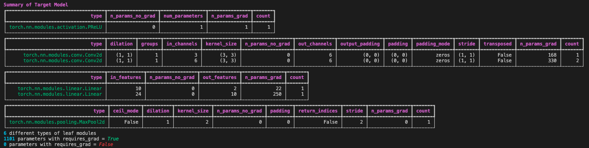
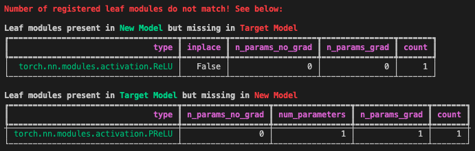
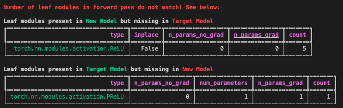
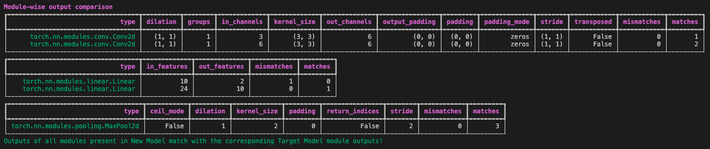
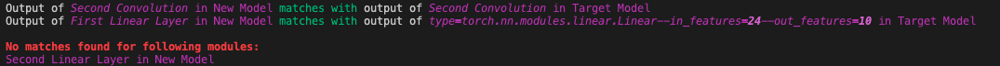

<div align="center">
  
</div>

**TorchBug** is a lightweight library designed to compare two PyTorch implementations of the same network architecture. It allows you to count, and compare, the different *leaf modules* (i.e., lowest level PyTorch modules, such as `torch.nn.Conv2d`) present both in the *target model* and the *new model*. These leaf modules are distinguished based on their attributes, so that an instance of `Conv2d` with a `kernel_size` of `3` and `stride` of `1` is counted separately from a `Conv2d` with `kernel_size` of `3` but `stride` `2`.

Further, when the leaf modules match, the library also provides you the functionality to initialize both the models equivalently, by initializing the leaf modules with weights using seeds which are obtained from the hash of their attributes. **TorchBug** then lets you pass the same input through both the models, and compare their outputs, or the outputs of intermediate leaf modules, to help find where the *new model* implementaion deviates from the *target model*.

[**Setup**](#setup)
| [**Usage**](#usage)
| [**Docs**](#docs)
| [**Examples**](#examples)

# Setup

To install, simply clone the repository, `cd` into the **TorchBug** folder, and run the following command:

```pip install .```

# Usage
To get started, check out [`demo.py`](demo.py).

# Docs
Docstrings can be found for all the functions. Refer [`compare.py`](torchbug/comparison/compare.py) and [`model_summary.py`](torchbug/summary/model_summary.py) for the main functions.

# Examples
## Summary of a model
Each row in the tables indicates a specific module type, along with a combination of its attributes, as shown in the columns.

- The second row in the second table indicates, for example, that there are two instances of `Conv2d` with 6 `in_channels` and 6 `out_channels` in the *Target Model*. Each of these modules has 330 parameters.



## Comparison of leaf modules
**TorchBug** lets you compare the leaf modules present in both models, and shows you the missing/extraneous modules present in either.



## Comparison of leaf modules invoked in the forward pass
The comparison of leaf modules invoked in forward pass ensures that the registered leaf modules are indeed consumed in the `forward` function of the models.




## Comparison of outputs of all leaf modules
After instantiating the *Target* and *New* models equivalently, and passing the same data through both of them, the outputs of intermediate leaf modules (of the same types and attributes) are compared (by brute force).
- The second row in the first table indicates, for example, that there are two instances of `Conv2d` with 6 `in_channels` and 6 `out_channels` in both the models, and their outputs match.



## Comparison of outputs of specific leaf modules only
**TorchBug** lets you mark specific leaf modules in the models, with names, and shows you whether the outputs of these marked modules match.



- In the above example, a convolution and two linear layers in the *New Model* were marked with names "Second Convolution", "First Linear Layer", and "Second Linear Layer".
- A convolution in the *Target Model* was marked with name "Second Convolution".
- All the other leaf modules in the *Target Model* were marked using a convenience function, which set the names to a string describing the module.
